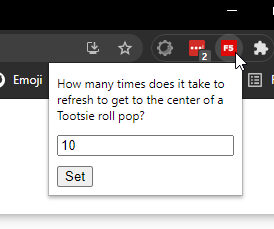

# Hyland Sitecore Developer Be Less Lazy Chrome Extension

### Instructions
Clone the repo and open up your [Chrome extensions](chrome://extensions/). Select 'Load Unpacked' and navigate to the repo. Select the top level directory and you're all set.

You can configure how frequently you get guilted into doing stuff by setting the reps in the extensions bar. This will change the frequency of being promted, but also who many reps you are told to do.

---

This extension is for the developer who is looking to get in better shape. It works like this:
- Fire up your local instance of Community, Training or Try.
- Once you have hit the browser reload button, F5 or if you're a weirdo like Bill, right click and then click Back x amount of times (see above), you will get a friendly reminder to go do a thing.
- Counter resets to zero daily.